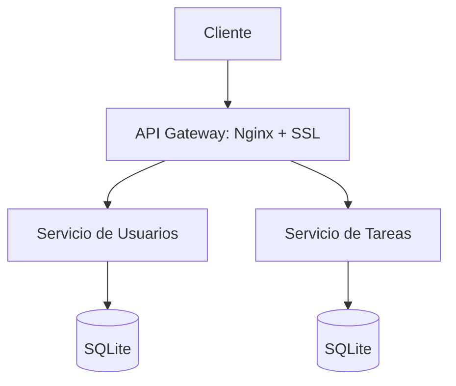

# Proyecto Unidad 2 y 3 - SysAdmin 2025

**Aplicación de gestión de tareas colaborativa con microservicios en Docker**  
*Administración de Redes - UTalca*  
**Prof. Ricardo Pérez** | *2025-1*

---

## 📌 Descripción
Despliegue seguro de la clásica aplicación "TO-DO" basada en microservicios (`user-service`, `task-service` y `admin`) con:
- **Docker** y **Docker Compose** para orquestación.
- Interfaz mínima para administración de proxy inverso.
- **Nginx** como API Gateway con SSL/TLS (Certbot + Let's Encrypt).
- Protección contra ataques DoS (rate limiting, timeouts). (futuro)
- Alta disponibilidad con réplicas y balanceo de carga. (futuro)

---

## 🛠️ Arquitectura

---

## Requisitos
- Docker 20.10+
- Docker Compose 2.5+
- Certbot (Let's Encrypt)
- slowhttptest y ab (para pruebas DoS)

## Despliegue
# 1. Clonar repositorio
- git clone https://github.com/tu-usuario/proyecto-sysadmin-2025.git
- cd proyecto-sysadmin-2025
# 2. Configurar dominio y SSL
- sudo certbot certonly --standalone -d tudominio.cl
# 3. Iniciar servicios
- docker-compose up -d --build
